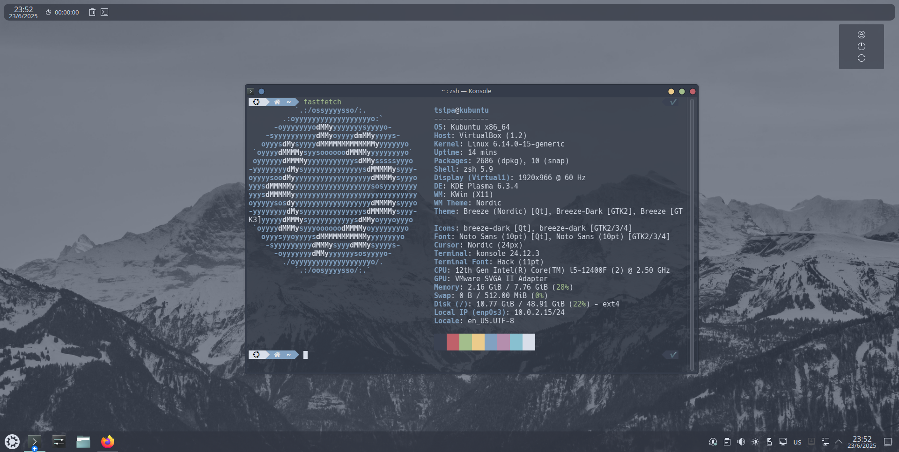
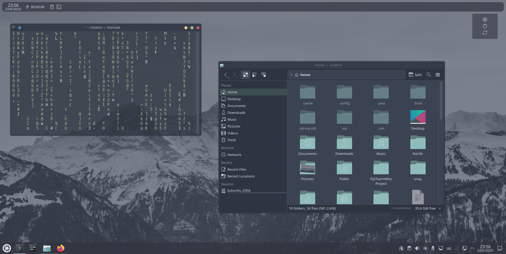
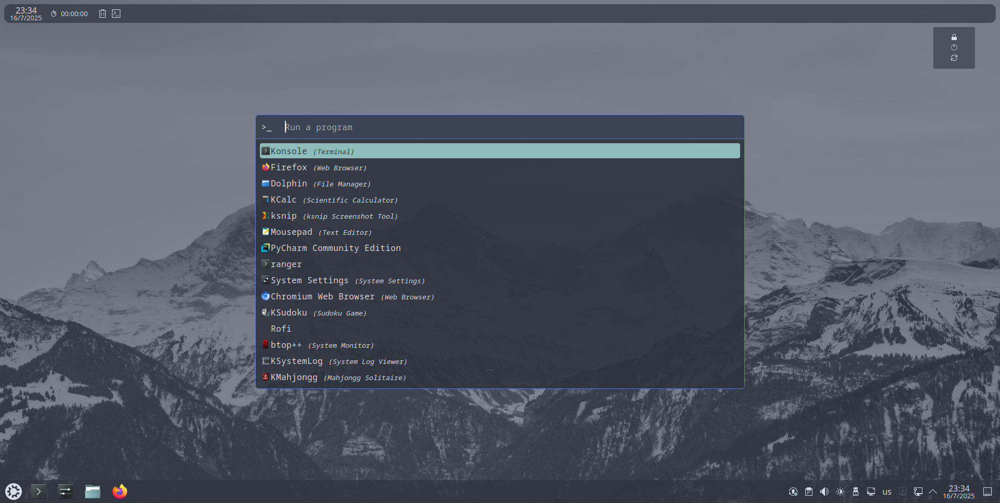

# KDE-Nordic-Config

Кастомизируем KDE Plasma с Nordic темой. Так же мы установим и настроим ZSH, Oh My ZSH и Rofi. Результат вы видите на скриншотах





## Скачиваем тему Nordic

И так первое что нам нужно сделать скачать Nordic и Nordic-KDE. Из Nordic будем брать иконки, курсоры, тему терминала Konsole. А Nordic-KDE - сама тема Nordic для KDE.

Переместимся в домашнюю директорию: `cd`
<br>

`git clone https://github.com/EliverLara/Nordic`
<br>
`git clone https://github.com/EliverLara/Nordic-kde`

Далее нам нужно переместить Nordic-kde в директорию `~/.local/share/plasma/desktopthemes` под именем Nordic.

Создаём директорию командой: `mkdir -p ~/.local/share/plasma/desktopthemes`
<br>
И перемещаем Nordic-Kde: `mv ~/Nordic-kde ~/.local/share/plasma/desktopthemes`

Далее берём директорию `aurorae` из директории `Nordic/kde` (не Nordic-kde!) и копируем в ~/.local/share/aurorae/themes

Создаём: `mkdir -p ~/.local/share/aurorae/themes`
<br>
Копируем: `cp -r ~/Nordic/kde/aurorae ~/.local/share/aurorae/themes`

Далее берём файл `Nordic.colors` из директории `Nordic/kde/colorschemes` и копируем в `.local/share/color-schemes`

Создаём: `mkdir -p ~/.local/share/color-schemes`
<br>
Копируем: `cp ~/Nordic/kde/colorschemes/Nordic.colors ~/.local/share/color-schemes/Nordic.colors`

Далее берём курсоры из директории `Nordic/kde/cursors/Nordic-cursors/` и копируем их в директорию `~/.icons`

Создаём: `mkdir -p ~/.icons`
<br>
Копирем: `cp -r ~/Nordic/kde/cursors/Nordic-cursors/ ~/.icons/Nordic-cursors`

Далее берём файл `Nordic.colorscheme` из директории `Nordic/kde/konsole` и копирем его в директорию `~/.local/share/konsole`:

Копируем: `cp ~/Nordic/kde/konsole/Nordic.colorscheme ~/.local/share/konsole/Nordic.colorscheme`
<br>
Далее создайте профиль в Konsole и, если хотите, сделайте его основным (ПКМ >> Create Profile >>). После во вкладке Apperance выберете Nordic.
После, желательно скачайте и установите шрифт `Hack Nerd Font`:

- Создайте директорию для шрифтов и перейдите в неё: `mkdir -p ~/.local/share/fonts && cd ~/.local/share/fonts`
- Скачайте шрифт: `wget https://github.com/ryanoasis/nerd-fonts/releases/download/v3.1.1/Hack.zip`
- Распакуйте: `unzip Hack.zip`
- И наконец установите его в систему: `fc-cache -fv`

После в настройках терминала укажите шрифт `Hack Nerd Font` и комфортный размер шрифта

Далее, скачайте красивые обои (например [такие](https://images.pling.com/img/00/00/36/61/48/2086140/nordic-mountain-wallpaper.jpg))

## Применение настроек

Зайдите в `System Settings`

- Перейдите в `Colors & Themes >>  Colors` и установите `Nordic`
- Перейдите в `Colors & Themes >> Plasma Style` и установите `Nordic`
- Перейдите в `Colors & Themes >> Windows Decorations` и установите `Nordic`
- Перейдите в `Colors & Themes >> Cursors` и установите `Nordic-cursors`

Далее щёлкните ПКМ по рабочему столу, затем Desktop and Wallpaper. Нажмите Add, перейдите в Pictures и выберите Nordic (или любые другие обои)

## Oh My Zsh

Далее необходимо скачать и установить zsh с oh my zsh.

`sudo apt install zsh`
<br>
После зайдите в настройки вашего профиля Konsole (ПКМ >> Edit current profile) >> Command. Измените `/bin/bash` на `/bin/zsh`
<br>
Далее скачайте oh my zsh:
<br>
`sh -c "$(curl -fsSL https://raw.githubusercontent.com/ohmyzsh/ohmyzsh/master/tools/install.sh)"`
<br>
И ответьте на вопросы

`Do you want to change your default shell to zsh? [Y/n]` - Хотите изменить оболочку на Zsh? - Рекомендую `n`
<br>
`Found ~/.zshrc. Backing up to ~/.zshrc.pre-oh-my-zsh` - Хотите сделать backup конфиг файла (возможно этот вопрос у вас не появится) - Рекомендую `y`

Готово! Oh My Zsh установлен. Теперь украсим его темами

Во первых установим красивые иконки в терминале: `git clone --depth=1 https://github.com/romkatv/powerlevel10k.git ${ZSH_CUSTOM:-$HOME/.oh-my-zsh/custom}/themes/powerlevel10k`
<br>
Далее нам необходимо из применить, откройте файл .zshrc: `nano .zshrc`
<br>
И найдите строчку **ZSH-THEME="..."** и замените её на **ZSH-THEME="powerlevel10k/powerlevel10k"**
Готово! Применяем изменения: `source ~/.zshrc`
<br>
Далее у вас откроется окно конфигурации (если вы захотите в будущем его перенастроить (или если у вас оно не откроется) напишите в терминале `p10k configure`):

Если вы хотите знать что это за вопрсы, пожалуйста посмотрите файл p10k_questions.txt.

Теперь установим красивые подсказки (красным - неверные комманды, зелёным - верные и существующие):

`git clone https://github.com/zsh-users/zsh-syntax-highlighting ${ZSH_CUSTOM:-~/.oh-my-zsh/custom}/plugins/zsh-syntax-highlighting`
<br>
<br>
Далее в файле `.zshrc` найдите строчку `plugins=(...)` и добавьте в конец `zsh-syntax-highlighting`. Должно получиться `plugins=(... zsh-syntax-highlighting)`
<br>
Готово! Применяем изменения: `source ~/.zshrc`

## Rofi

Rofi - мощный инструмент для запуска приложений только по их названию / части названия. Сейчас мы его установим и настроем.

Установка: `sudo apt install rofi`
<br>
Далее скачаем  и переместим тему Nordic для rofi:
<br>
Скачиваем: `git clone https://github.com/undiabler/nord-rofi-theme`
<br>
Создаём директорию: `mkdir ~/.config/rofi`
<br>
Перемещаем: `mv nord-rofi-theme/nord.rasi ~/.config/rofi/nordic.rasi`
<br>
Очистка: `rm -rf nord-rofi-theme`
<br>
Создаём config: `cd ~/.config/rofi && nano config.rasi`
<br>
Далее вставьте туда этот текст:
```
configuration {
    modi: "drun,run,window";
    show-icons: true;
    display-drun: ">_";
    display-run: ">_";
    display-window: ">_";
}

entry {
    placeholder: "Run a program";
    placeholder-color: #adadad;
}

@theme "~/.config/rofi/nordic.rasi"
```

## Ranger

### О Ranger

Ranger - файловый менеджер работающий без GUI (работает только в терминале, CLI). Использует горячие клавиши Vim. Возможно, вам понравится это больше чем стандартные файловые менеджеры типа Thunar и Dolphin. Более подробно вы можете прочитать в Интернете.

### Установка Ranger

Если вам такое интресено, можете установить командой

`sudo apt install ranger`
<br>

И запустить аналогично: `ranger`.

## Vimium

### О Vimium

Vimium - браузерное расширения для Google Chrome, Mozilla Firefox, и другие браузеров. Он позволяет использовать только клавиатуру для сёрфинга с Интернете. Для просмотра всех ссылок вы можете нажать клавишу `F`, а для перехода по ссылке нажать соответствующее сочитание клавиш. Также для скрола стракницы можно использовать клавиши `HJKL`. Для просмотра всех горячих клавиш достаточно нажать на `?`

### Установка Vimium

* [Для FireFox](https://addons.mozilla.org/ru/firefox/addon/vimium-ff/)
* [Для Google Chrome](https://chromewebstore.google.com/detail/vimium/dbepggeogbaibhgnhhndojpepiihcmeb)
* [Для Microsoft Edge](https://microsoftedge.microsoft.com/addons/detail/vimium/djmieaghokpkpjfbpelnlkfgfjapaopa)
* [Официальный сайт разработчика](https://vimium.github.io/) / [GitHub](https://github.com/philc/vimium)
